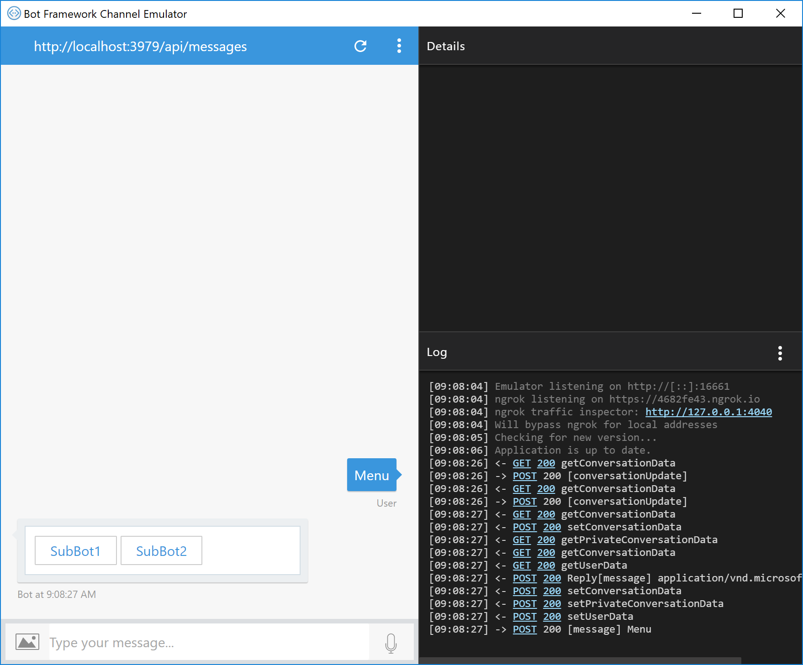
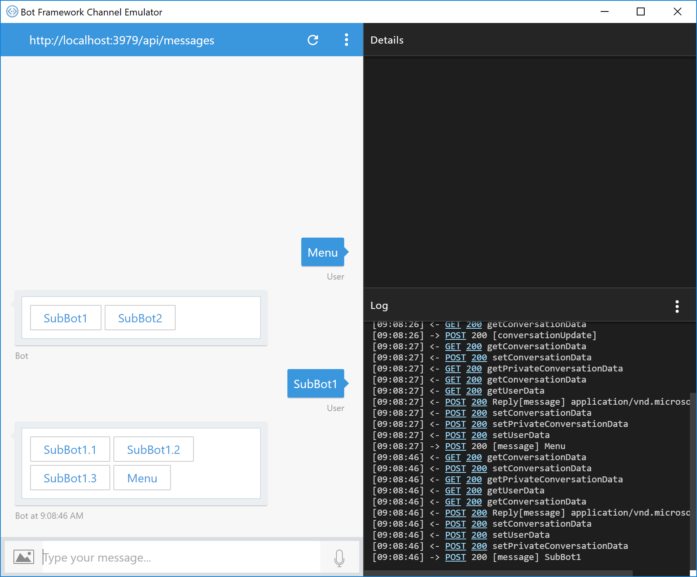
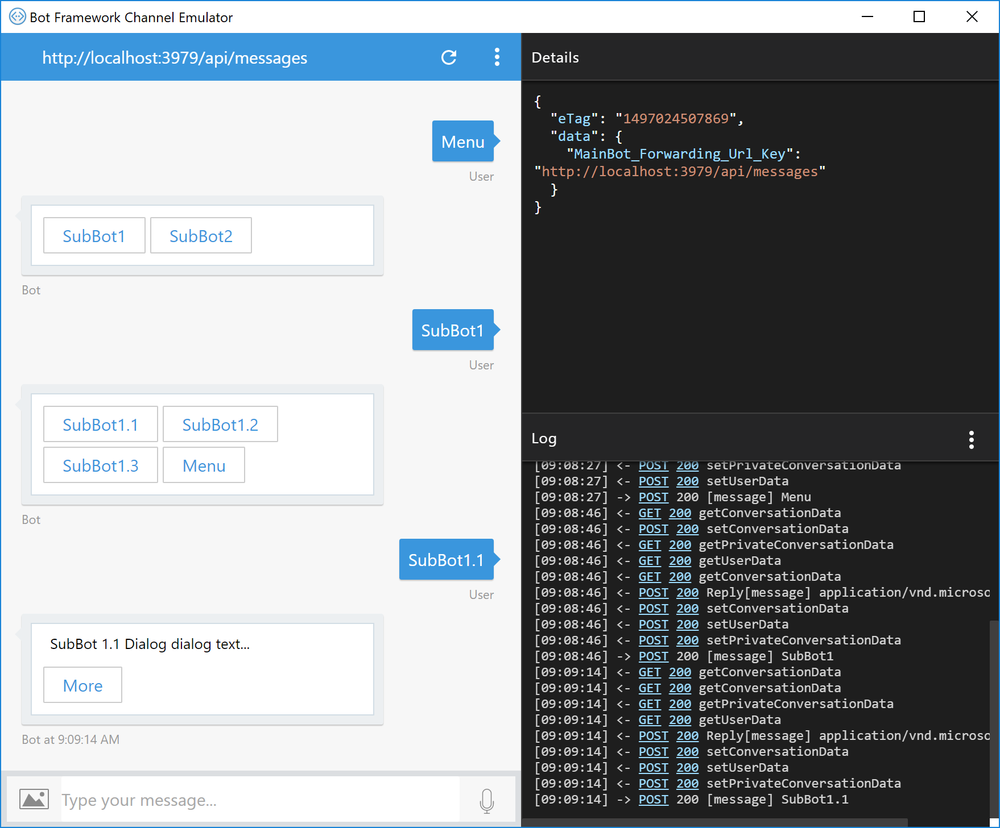
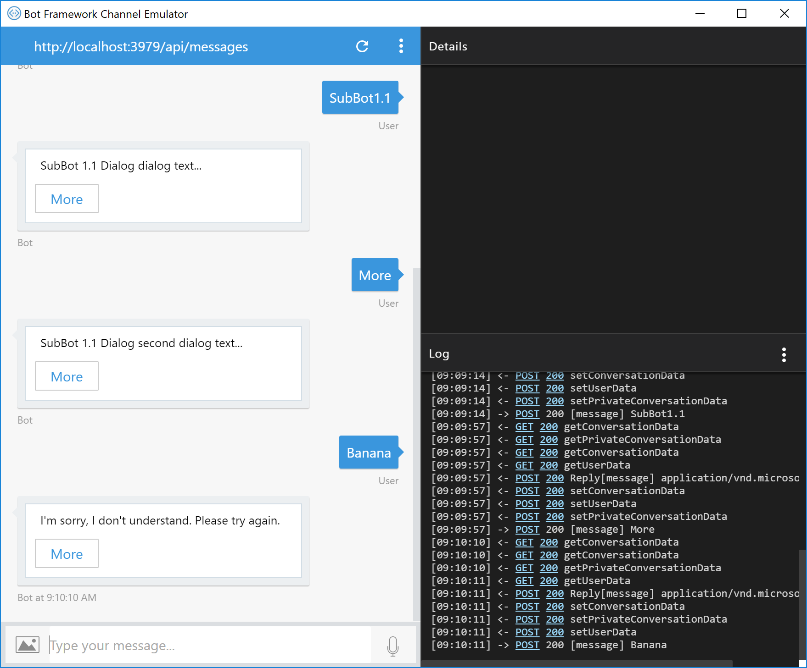
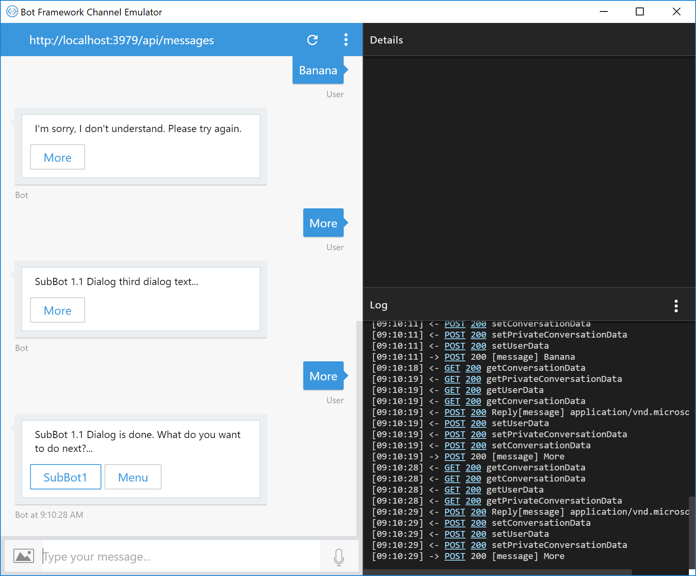
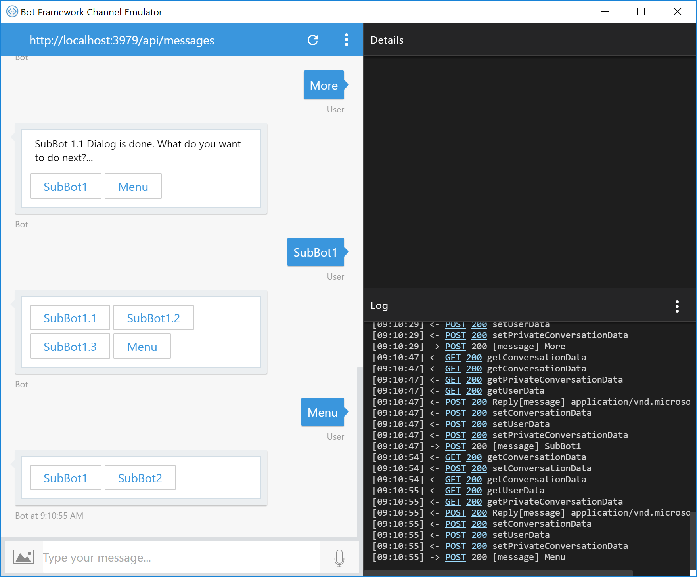
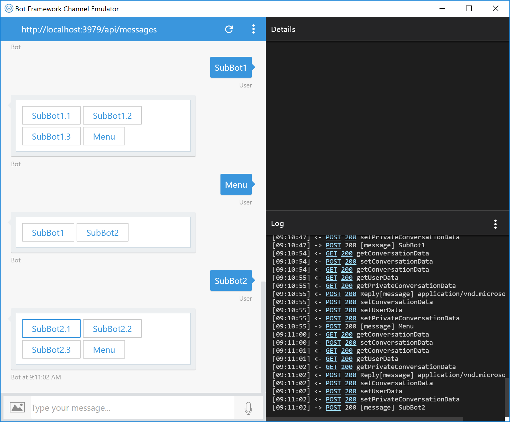
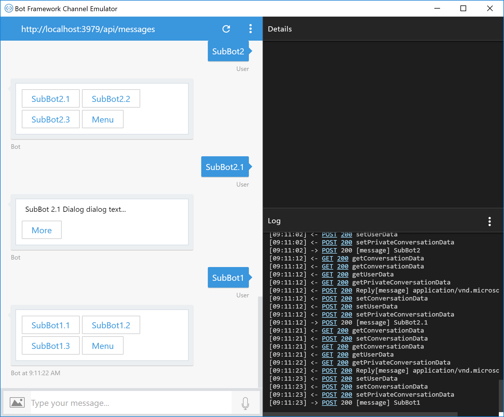

# BotToBot-Handoff Sample Bot

A sample that shows how to create a single bot user experience that is made up of independently developed and deployed bots. 

In this sample, the user has a conversation with a single "main bot" that "hands-off" the conversation to various "sub-bots" for its functionality. Each sub-bot can be developed and deployed independently by disparate teams, even using different programming languages supported by the [Bot Framework](https://dev.botframework.com/).

For example, consider an "intranet bot" for a large enterprise that includes support for conversations about HR, Finance, HelpDesk, etc. Like an intranet site is made up of sub-sites (developed independently) for HR, Finance, HelpDesk, etc. and linked into a common navigation scheme, an "intranet bot" could provide navigation to different sub-bots for each function and hand-off conversations to the appropriate sub-bot.

### Prerequisites

To run this sample, install the prerequisites by following the steps in the [Bot Builder SDK for .NET Quickstart](https://docs.microsoft.com/en-us/bot-framework/dotnet/bot-builder-dotnet-quickstart) section of the documentation.

This sample assumes you're familiar with:
* [Bot Builder for .NET SDK](https://docs.microsoft.com/en-us/bot-framework/dotnet/bot-builder-dotnet-overview)
* [Dialog API](https://docs.botframework.com/en-us/csharp/builder/sdkreference/dialogs.html)
* [Global Message Handlers](https://docs.microsoft.com/en-us/bot-framework/dotnet/bot-builder-dotnet-global-handlers)
* [Conversation Navigation](https://github.com/cmayomsft/BotBuilder-Getting-Started/tree/master/CSharp/basics-Navigation).

### Overview

In the bot-to-bot handoff scenario above, the user has a conversation with a bot that is actually comprised of two types of bots:
* Main Bot - A bot that provides conversational UI (CUI) to allow users navigate to the various sub-bots and hands off messages to the sub-bot.
* Sub-bots - Bots that provide the actual conversation functionality of the overall bot solution. Sub-bots provide their own navigation CUI for navigating their own conversation flows, CUI to support their conversation flows, and navigation CUI for navigating back to the main-bot.

### Conversation Navigation

In each of the bots, conversation navigation (or the ability to change the topic of conversation) is handled via [Global Message Handlers](https://github.com/Microsoft/BotBuilder-Samples/tree/master/CSharp/core-GlobalMessageHandlers) that inspect each message for pre-defined navigation commands supported by that bot. When a Global Message Handler matches a navigation command to the [`Text`](https://docs.microsoft.com/en-us/dotnet/api/microsoft.bot.connector.imessageactivity.text?view=botbuilder-3.8#Microsoft_Bot_Connector_IMessageActivity_Text) of an [`IMessageActivity`](https://docs.microsoft.com/en-us/dotnet/api/microsoft.bot.connector.imessageactivity?view=botbuilder-3.8), the handler changes the conversation flow by resetting the dialog stack and forwarding the message to the `RootDialog` for the bot. The `RootDialog` inspects the `IMessageActivity` and calls the appropriate dialog for the conversation flow. The `RootDialog` also takes the appropriate action when that Dialog is finished (either successfully by calling [`IDialogStack.Done()`](https://docs.microsoft.com/en-us/dotnet/api/microsoft.bot.builder.dialogs.internals.idialogstack.done--1?view=botbuilder-3.8#Microsoft_Bot_Builder_Dialogs_Internals_IDialogStack_Done__1___0_) or unsuccessfully via [`IDialogStack.Fail`](https://docs.microsoft.com/en-us/dotnet/api/microsoft.bot.builder.dialogs.internals.idialogstack.fail?view=botbuilder-3.8#Microsoft_Bot_Builder_Dialogs_Internals_IDialogStack_Fail_System_Exception_). Navigation commands are global to the bot, since every message is inspected for navigation commands, allowing the user to change the topic of conversation at any time in the conversation. Navigation commands differ from replies, which apply to a specific prompt ("What is your name?") from the active dialog in the conversation flow. A message is considered a reply to a prompt from the active dialog if it doesn't match any navigation commands. 

For more details on providing conversation navigation in a bot, see the [Conversation Navigation](https://github.com/cmayomsft/BotBuilder-Getting-Started/tree/master/CSharp/basics-Navigation) sample.

### Handoff

In this sample, the handoff between the main bot each of the sub-bots is facilitated by the sub-bots sharing their messaging endpoint URL (e.g. /api/messages) and their top-level navigation commands (those that would cause a handoff to that sub-bot) with the main bot. 

The main bot inspects every incoming message. If the main bot matches the incoming message text with a sub-bot's top-level navigation command (similar to the [Conversation Navigation](#Conversation-Navigation) discussion above), the main bot forwards that message to the sub-bot's messaging URL. 

When the sub-bot receives that message (a navigation command), its Global Message Handler code takes the appropriate action by resetting the dialog stack, forwarding the message to its `RootDialog`, and calling the correct dialog to handle the navigation command.

The main bot will continue forwarding messages to that sub-bot until it encounters another navigation command for another bot.

Note: The main bot and each of the sub-bots share the same AppID and AppPassword. This allows all the bots to share the same conversation ID, [`Dialog Stack`](https://docs.microsoft.com/en-us/dotnet/api/microsoft.bot.builder.dialogs.internals.idialogstack?view=botbuilder-3.8), and [Bot State Data](https://docs.microsoft.com/en-us/bot-framework/dotnet/bot-builder-dotnet-state). 

### Bot-to-Bot Handoff in Action

Let's see the sample in action so you can see how the solution comes together.

The sample includes a main bot ([`MainBot`](\MainBot\Controllers\MessagesController.cs)), and two sub-bots ([`SubBot1`](\SubBot1\Controllers\MessagesController.cs) and [`SubBot2`](\SubBot2\Controllers\MessagesController.cs)), to show handing off from the main bot to sub-bots and back.

#### Navigation Commands

MainBot includes navigation commands to show its navigation menu and to hand-off to the sub-bots. SubBot1 and SubBot2 include navigation commands for navigating their conversation flows and for handing back to the MainBot, including:

* MainBot
  * "Menu" - Shows the navigation UI for the MainBot, in this sample a HeroCard with buttons that navigate, or hand-off, to each of the sub-bots.
  * "SubBot1" - Starts a hand-off to SubBot1 and displays the navigation UI for SubBot1.
  * "SubBot2" - Starts a hand-off to SubBot2 and displays the navigation UI for SubBot2.

* SubBot1
  * "SubBot1" - Shows the navigation UI for the SubBot1, in this sample a HeroCard with buttons that call dialogs for each of the SubBot1's conversation flows and a button to hand back to the MainBot.
  * "SubBot1.1" - Calls the SubBot1_1_Dialog dialog to start a conversation flow.
  * "SubBot1.2" - Calls the SubBot1_2_Dialog dialog to start a conversation flow.
  * "SubBot1.3" - Calls the SubBot1_3_Dialog dialog to start a conversation flow.
  * "Menu" - Shows the MainBot navigation UI, allowing the user to navigate to other sub bots.

* SubBot2
  * Follows the same pattern as the SubBot1 navigation above.

#### Sample Walkthrough

When you start the MainBot, type "Menu" to show the MainBot's navigation menu.



The MainBot navigation menu has buttons for navigating, or handing off, to each of the sub-bots, "SubBot1" and "SubBot2".

When you click on the "SubBot1" button, it posts "SubBot1" to the conversation. This will cause the SubBot1 bot to become the active bot. SubBot1 will respond by showing its navigation menu.



**Note:** The HeroCard above is coming from SubBot1, not MainBot, but to the user it appears to be a single conversation with a single bot. 

The SubBot1 navigation menu has buttons for each of its navigation commands and to show the MainBot's navigation menu ("Menu").

Click the "SubBot1.1" button, which calls the `SubBot1_1_Dialog` to start a conversation flow.



At this point in the conversation, the user can reply with any of the navigation commands from any of the bots, or reply to the active prompt from the active dialog to move the conversation forward. In this case, clicking the "More" button will move the dialog to the next prompt. Replying with anything other than a navigation command or "More" will not be understood by the SubBot1_1_Dialog.



When the SubBot1_1_Dialog completes, it shows a navigation menu with buttons that allow the user to navigate back to the SubBot1 navigation menu ("SubBot1"), or to hand back to the MainBot and show the main bot navigation menu ("Menu").



Clicking the "SubBot1" button shows SubBot1's navigation menu.


Clicking the "Menu" button passes control back to MainBot and shows the MainBot's navigation menu.



Clicking the "SubBot2" button on the MainBot's navigation menu will hand off control to SubBot2 and show its navigation menu.



**Note:** The user can type a navigation command (for example, "SubBot1") from anywhere in the conversation to hand-off to that bot.



### Code Walkthrough

Let's see how this is accomplished in code:

#### Managing Handoffs

In the MainBot's [`MessageController`](\MainBot\Controllers\MessagesController.cs), MainBot stores the navigation commands that cause hand-offs to sub-bots and the corresponding sub-bot messaging URLs in a `Dictionary`. 

````C#
// TODO: Replace with registration Web API so trusted bots can publish their commands and forwarding URLs dynamically.

// Navigation commands and forwarding URLs for main and all sub bots.
private static readonly Dictionary<string, string> NavCommandForwardingUrls = new Dictionary<string, string>()
{
    { "Menu", "http://localhost:3979/api/messages" },
    { "SubBot1", "http://localhost:3980/api/messages" },
    { "SubBot2", "http://localhost:3981/api/messages" }
};
````

**Note:** These commands and URLs are hardcoded for simplicity. This could be done dynamically by adding a registration Web API to the MainBot so trusted bots could publish their navigation commands and forwarding URLs dynamically, for example. 

**Note:** Navigation commands must be unique across all the bots since the MainBot inspects every message, even those being forwarded to a sub-bot, for navigation commands.

In the MainBot's [`MessageController`](MainBot\Controllers\MessagesController.cs) Post method, the messaging URL for the current bot (either MainBot or one of the sub-bots) is retrieved from Conversation State.

````C#
string conversationID = activity.Conversation.Id;

StateClient stateClient = activity.GetStateClient();
BotData conversationData = await stateClient.BotState.GetConversationDataAsync(activity.ChannelId, activity.Conversation.Id);

// The URL of the currently active bot, either main or one of the sub bots.
var forwardingUrl = conversationData.GetProperty<string>(Resources.MainBot_Forwarding_Url_Key);
````

If the current Activity is a `IMessageActivity`, its `Text` property is checked to see if it matches a navigation command for the main bot or one of the sub-bots. If there is a match, the messaging URL for the corresponding bot is saved to conversation state and will be used to hand-off, or forward, the message to that bot.

````C#
// If the activity is a message, check to see if it's a navigation command.
if (activity.Type == ActivityTypes.Message)
{
    var message = activity as IMessageActivity;

    if (message != null && !string.IsNullOrWhiteSpace(message.Text))
    {
        var commandUrl = (from cmd in NavCommandForwardingUrls
                        where message.Text.Equals(cmd.Key, StringComparison.InvariantCultureIgnoreCase)
                        select cmd.Value).FirstOrDefault();

        if (commandUrl != null && !string.IsNullOrWhiteSpace(commandUrl))
        {
            // If the forwarding url has changed, save it to conversation state.
            if (!commandUrl.Equals(forwardingUrl, StringComparison.InvariantCultureIgnoreCase))
            {
                forwardingUrl = commandUrl;

                conversationData.SetProperty<string>(Resources.MainBot_Forwarding_Url_Key, forwardingUrl);
                await stateClient.BotState.SetConversationDataAsync(activity.ChannelId, activity.Conversation.Id, conversationData);
            }
        }
    }
}
````

If the URL of the active bot corresponds to the main bot, the message is sent to the MainBot's `RootDialog`. Otherwise, the message is forwarded to the sub-bot by sending it to the sub-bot's messaging URL via an HTTP Post.

````C#
// If the forwarding URL is the main bot URL, send the message to the dialog stack.
if ((forwardingUrl == null) || this.Request.RequestUri.ToString().Equals(forwardingUrl, StringComparison.InvariantCultureIgnoreCase))
{
    if (activity.Type == ActivityTypes.Message)
    {
        await Conversation.SendAsync(activity, () => new RootDialog());
    }
    else
    {
        this.HandleSystemMessage(activity);
    }

    var response = this.Request.CreateResponse(HttpStatusCode.OK);
    return response;
}
else
{
    // Else forward the message to the sub bot at the forwarding URL.
    var client = new HttpClient();

    var request = new HttpRequestMessage()
    {
        RequestUri = new Uri(forwardingUrl),
        Method = HttpMethod.Post
    };

    // Copy the message headers to the forwarding request.
    foreach (var header in this.Request.Headers)
    {
        request.Headers.Add(header.Key, header.Value);
    }

    // Change the host for the request to be the forwarding URL.
    request.Headers.Host = request.RequestUri.Host;

    var json = JsonConvert.SerializeObject(activity);
    var content = new StringContent(json, Encoding.UTF8, "application/json");

    request.Content = content;

    return await client.SendAsync(request);
}
````

#### Fielding a Handoff

In each "sub-bot", the Global Message Handler code will be inspecting incoming messages for navigation commands. Per the [Conversation Navigation](#Conversation-Navigation) discussion above, if the message text matches a navigation command, the dialog stack is cleared and the message is forwarded to the `Root Dialog`. 

In SubBot1's [`RootDialog`](SubBot1\Dialogs\RootDialog.cs), the navigation command is used to display the navigation menu card for the bot ("SubBot1") or to call the appropriate dialog for the command ("SubBot1.1").

Note: In `ShowNavMenuAsync`, SubBot1 facilitates navigation back to the MainBot by adding a `CardAction` that posts the MainBot's main navigation command ("Menu") to the conversation. This navigation command will be picked up by the MainBot's [`MessageController`](MainBot\Controllers\MessagesController.cs) and will cause the stack to be reset and the MainBot's navigation menu to be displayed.

````C#
[Serializable]
public class RootDialog : IDialog<object>
{
    public async Task StartAsync(IDialogContext context)
    {
        context.Wait(this.MessageReceived);
    }

    private async Task MessageReceived(IDialogContext context, IAwaitable<IMessageActivity> result)
    {
        var message = await result;

        // If the message matches a navigation command, take the correct action (post something to the conversation, call a dialog to change the conversation flow, etc.
        if (message.Text.ToLowerInvariant() == Resources.SubBot1_Menu.ToLowerInvariant())
        {
            await this.ShowNavMenuAsync(context);
        }
        else if (message.Text.ToLowerInvariant() == Resources.SubBot1_1_Menu.ToLowerInvariant())
        {
            context.Call(new SubBot1_1_Dialog(), this.SubBot1_X_DialogResumeAfter);
        }
        else if (message.Text.ToLowerInvariant() == Resources.SubBot1_2_Menu.ToLowerInvariant())
        {
            context.Call(new SubBot1_2_Dialog(), this.SubBot1_X_DialogResumeAfter);
        }
        else if (message.Text.ToLowerInvariant() == Resources.SubBot1_3_Menu.ToLowerInvariant())
        {
            context.Call(new SubBot1_3_Dialog(), this.SubBot1_X_DialogResumeAfter);
        }
        else
        {
            // Else something other than a navigation command was sent, and this dialog only supports navigation commands, so explain the bot doesn't understand the command.
            await this.StartOverAsync(context, string.Format(Resources.Do_Not_Understand, message.Text));
        }
    }

    private async Task ShowNavMenuAsync(IDialogContext context)
    {
        var reply = context.MakeMessage();

        var menuHeroCard = new HeroCard
        {
            Buttons = new List<CardAction>
            {
                new CardAction(ActionTypes.ImBack, Resources.SubBot1_1_Menu, value: Resources.SubBot1_1_Menu),
                new CardAction(ActionTypes.ImBack, Resources.SubBot1_2_Menu, value: Resources.SubBot1_2_Menu),
                new CardAction(ActionTypes.ImBack, Resources.SubBot1_3_Menu, value: Resources.SubBot1_3_Menu),
                new CardAction(ActionTypes.ImBack, Resources.MainBot_Menu, value: Resources.MainBot_Menu)
            }
        };

        reply.Attachments.Add(menuHeroCard.ToAttachment());
            
        await context.PostAsync(reply);

        context.Wait(this.ShowNavMenuResumeAfterAsync);
    }

    private async Task SubBot1_X_DialogResumeAfter(IDialogContext context, IAwaitable<object> result)
    {
        try
        {
            var diagResults = await result;
        }
        catch (Exception ex)
        {
            throw ex;
        }
        finally
        {
            await this.ShowNavMenuAsync(context);
        }
    }

    private async Task ShowNavMenuResumeAfterAsync(IDialogContext context, IAwaitable<IMessageActivity> result)
    {
        var message = await result;

        // If we got here, it's because something other than a navigation command was sent to the bot (navigation commands are handled in NavigationScorable middleware), 
        //  and this dialog only supports navigation commands, so explain bot doesn't understand the message.
        await this.StartOverAsync(context, string.Format(Resources.Do_Not_Understand, message.Text));
    }

````


### More Information

For more information on the concepts shown in this sample, check out the following resources:
* [Bot Builder for .NET SDK](https://docs.microsoft.com/en-us/bot-framework/dotnet/bot-builder-dotnet-overview)
* [Dialog API](https://docs.botframework.com/en-us/csharp/builder/sdkreference/dialogs.html)
* [Global Message Handlers](https://docs.microsoft.com/en-us/bot-framework/dotnet/bot-builder-dotnet-global-handlers)
* [Conversation Navigation](https://github.com/cmayomsft/BotBuilder-Getting-Started/tree/master/CSharp/basics-Navigation)
